# Simpler

[](https://github.com/liying2008/Simpler/releases)
[](https://codeload.github.com/liying2008/Simpler/zip/master)
[](https://github.com/liying2008/Simpler/blob/master/LICENSE)
[](http://weibo.com/neuliying)

---
**此项目仅供Android开发学习交流使用，不得用于其他用途。**

[Download APK](https://github.com/liying2008/Simpler/releases/download/v1.0.2/simpler_1.0.2.apk)

编译环境
----
- Android Studio 2.3.3
- Gradle 3.3

### 说明
1. 应用中使用的图片资源大多来自[锤子科技论坛](http://www.smartisan.com/apps/bbs)，应用界面设计也较大程度参考了锤子科技论坛，特此声明。
1. 应用采用OAuth2认证授权，应用本身**不会**保存你的任何帐号和密码信息。
1. **此项目仅供Android开发学习交流使用，不得用于其他用途，也不允许将此项目打包后在应用商店中发布。**


主要功能
----
Simpler是一款轻量级的第三方微博应用，具有微博的基础功能，兼有外观优雅，运行流畅，内存占用低，省电省流量等特点。

屏幕截图
----
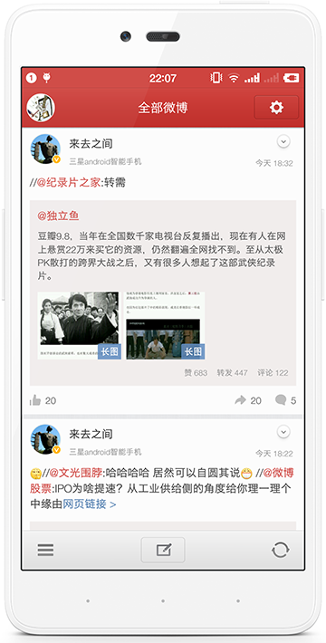
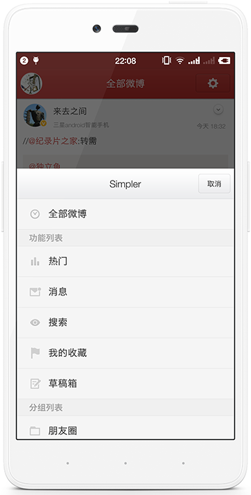
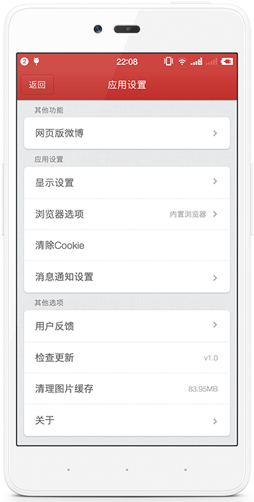
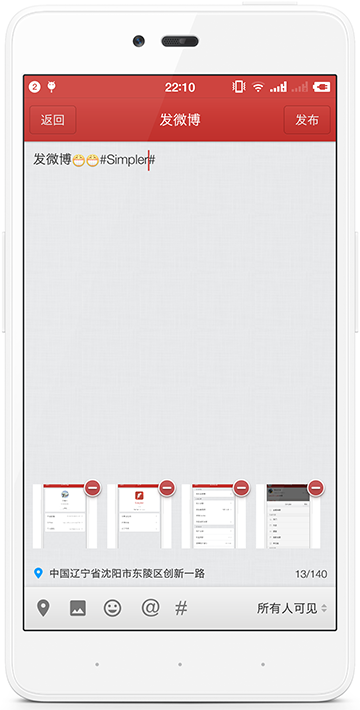
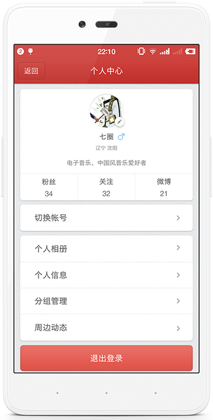

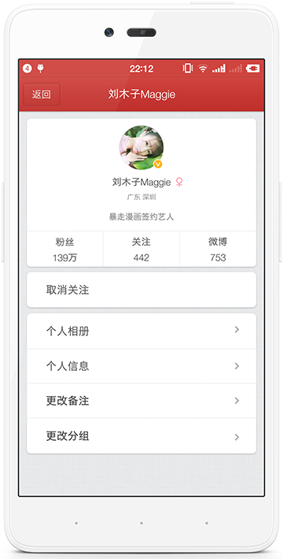

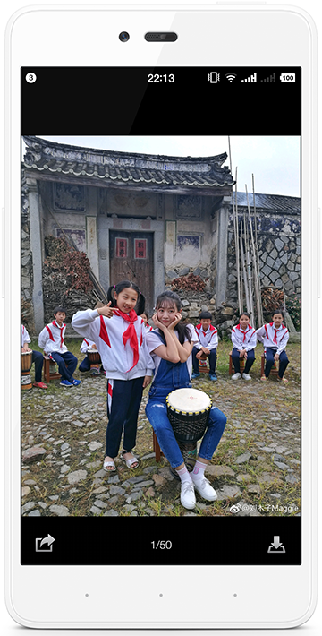
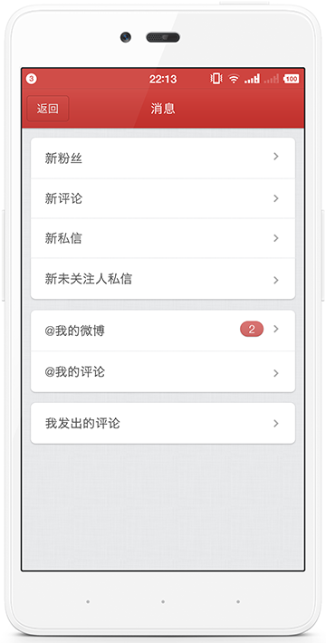

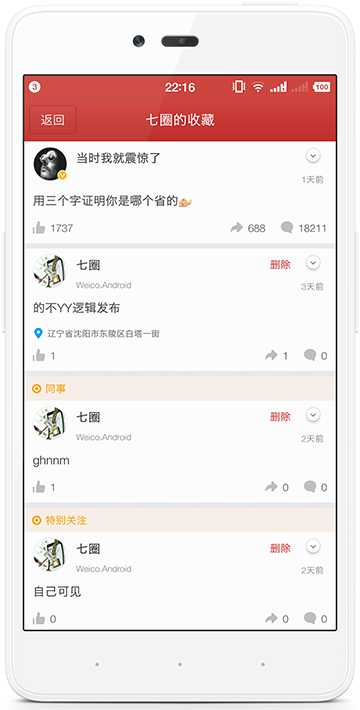
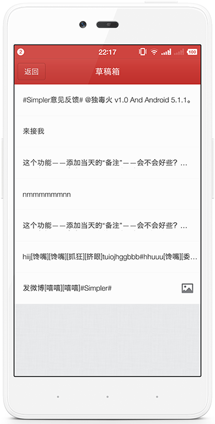
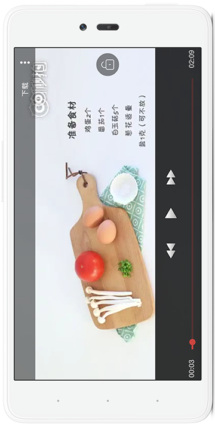
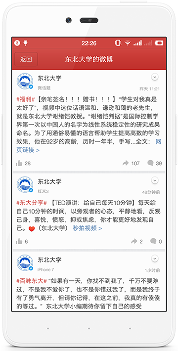


实现功能
----
1. 微博：浏览微博 / 发布微博 / 转发微博 / 复制微博内容 / 热门微博 / 搜索微博 / 周边动态
2. 评论：浏览评论 / 发表评论 / 转发评论 / 回复评论 / 复制评论
3. 用户：查看用户基本信息 / 粉丝  / 关注  / 用户微博 / 相册
4. 关系：关注用户 / 取消关注 / 移出分组 / 更改分组
5. 消息：消息通知 / 私信通知 / 发出的评论  / 收到的评论 / @我的微博 / @我的评论
6. 话题：热门话题 / 查看话题 / 搜索话题微博
7. 收藏：添加收藏 / 取消收藏 / 查看收藏
8. 帐号：添加帐号 / 退出登录 / 多用户切换 / 更改头像
9. 草稿箱：将未发布的微博加入草稿箱 / 查看草稿箱 / 删除草稿
10. 分组：查看分组微博 / 添加分组 / 删除分组 / 编辑分组
11. 微博详情：查看图片 / 下载图片 / 分享图片 / 观看秒拍视频 / 下载秒拍视频
12. 赞：点赞 / 取消赞 / 原微博点赞和取消赞
13. 网页版微博
14. 设置：微博字体大小 / 每次刷新微博数 / 微博图片显示质量 / 图片上传质量
15. 消息通知：关闭 / 开启 / 通知时间间隔
16. 其他：清理图片缓存 / 检查更新 / 用户反馈

### 其他特性
> 支持绑定多个用户  
> 支持分页加载和下拉刷新  
> 支持发送带有多张图片的微博  
> 支持微博缓存（节省流量）  
> 微博列表快速滑动时不加载图片（节省流量）  
> 视频播放界面，允许锁定横屏或竖屏（非常适用于躺在床上看视频）  
> 支持将关注的好友添加进多个分组  
> 支持为好友添加备注  
> 如果发布的微博是分组微博、私密微博或朋友圈微博，微博列表会标注该条微博的可见分组。  


已知BUG
-----
1. 加载GIF图时无法获取加载进度。  

更新日期
----
2017-6-15  

当前版本
----
v1.0.2  

联系作者
----
新浪微博：[@独毒火](http://weibo.com/neuliying)  
邮箱：[liruoer2008@yeah.net](mailto:liruoer2008@yeah.net)  

Thanks
----
- [weibo_android_sdk](https://github.com/sinaweibosdk/weibo_android_sdk)
- [PhotoView](https://github.com/chrisbanes/PhotoView)
- [glide](https://github.com/bumptech/glide)
- [okhttp](https://github.com/square/okhttp)
- [okio](https://github.com/square/okio)
- [butterknife](https://github.com/JakeWharton/butterknife)
- [CircleImageView](https://github.com/hdodenhof/CircleImageView)
- [jsoup](https://github.com/jhy/jsoup)
- [LoadingProgress](https://github.com/peng8350/LoadingProgress)
- [guava](https://github.com/google/guava)
- [FileDownloader](https://github.com/lingochamp/FileDownloader)

License
----

```
Copyright 2017 LiYing

Licensed under the Apache License, Version 2.0 (the "License");
you may not use this file except in compliance with the License.
You may obtain a copy of the License at

   http://www.apache.org/licenses/LICENSE-2.0

Unless required by applicable law or agreed to in writing, software
distributed under the License is distributed on an "AS IS" BASIS,
WITHOUT WARRANTIES OR CONDITIONS OF ANY KIND, either express or implied.
See the License for the specific language governing permissions and
limitations under the License.
```


